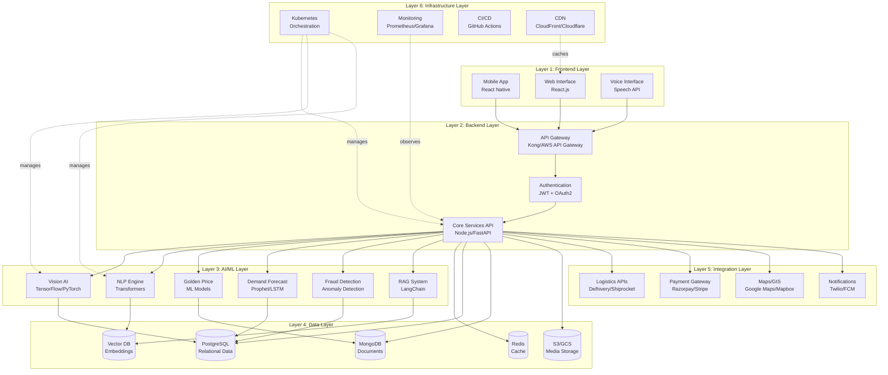
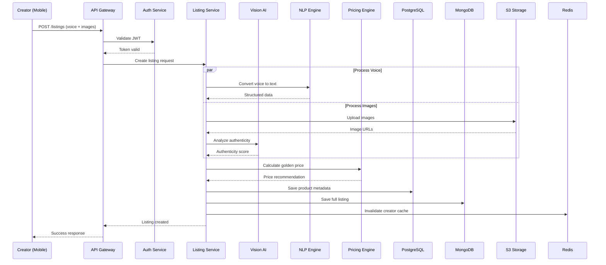
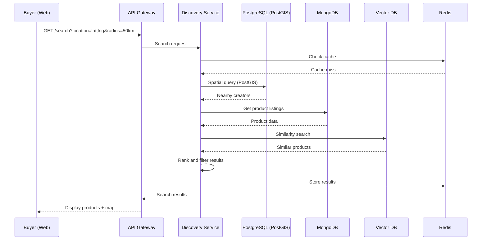

# Design Document: Qalakar.ai

## Overview

Qalakar.ai is an AI-powered marketplace and intelligence platform that transforms how creators living far from urban centers produce, price, and sell handicrafts. The platform addresses core challenges of financial risk, market access, and authenticity verification through a sophisticated AI ecosystem combining RAG (Retrieval-Augmented Generation), computer vision, NLP, and machine learning.

The system is designed around three core pillars:

1. **Intelligence Layer**: AI-driven pricing, demand forecasting, and production recommendations that reduce financial risk
2. **Verification Layer**: Vision AI and fraud detection that ensure marketplace authenticity and protect genuine creators
3. **Access Layer**: Hyperlocal discovery, digital identity, and logistics optimization that expand market reach

The platform emphasizes convenience and speed for technically capable users, not literacy accommodation. Creators are skilled professionals who benefit from AI-powered insights and streamlined workflows.

## Architecture

Qalakar.ai follows a modern microservices architecture organized into six distinct layers, each with clear responsibilities and separation of concerns. This architecture enables independent scaling, technology flexibility, and maintainability while supporting the platform's AI-driven intelligence capabilities.

### Architecture Overview



### Layer 1: Frontend Layer

The frontend layer provides multiple interfaces optimized for creator convenience and speed, emphasizing efficiency for technically capable users.

#### 1.1 Mobile Application (React Native)

**Purpose**: Primary interface for creators to manage their business on-the-go

**Key Features**:
- Cross-platform (iOS/Android) with native performance
- Offline-first architecture with local data sync
- Camera integration for product photography
- Voice input for quick listing creation
- Push notifications for orders and price updates
- GPS integration for location-based features

**Technology Stack**:
- Framework: React Native 0.72+
- State Management: Redux Toolkit + RTK Query
- Navigation: React Navigation 6
- Offline Support: Redux Persist + AsyncStorage
- Camera: react-native-camera or expo-camera
- Maps: react-native-maps
- Voice: react-native-voice or expo-speech

**Key Screens**:
- Dashboard: Sales metrics, inventory, pending orders
- Listing Creator: Voice/text input with AI assistance
- Portfolio Manager: Digital showcase editor
- Order Management: Order tracking and fulfillment
- Insights: Pricing recommendations, demand forecasts
- Discovery: Hyperlocal creator and product search

#### 1.2 Web Interface (React.js)

**Purpose**: Full-featured interface for buyers and creators who prefer desktop access

**Key Features**:
- Responsive design (mobile, tablet, desktop)
- Advanced search and filtering
- Interactive maps for craft cluster exploration
- Heritage trail visualization
- Detailed analytics dashboards
- Bulk operations for creators

**Technology Stack**:
- Framework: React 18+ with TypeScript
- State Management: Redux Toolkit + RTK Query
- UI Components: Material-UI or Chakra UI
- Maps: Mapbox GL JS or Google Maps JavaScript API
- Charts: Recharts or Chart.js
- Forms: React Hook Form + Zod validation
- Build Tool: Vite or Next.js

**Key Pages**:
- Marketplace: Product browsing with filters
- Creator Profiles: Digital portfolios with stories
- Craft Clusters: Geographic visualization
- Heritage Trails: Interactive route maps
- Analytics Dashboard: Business intelligence for creators
- Admin Panel: Platform management and moderation

#### 1.3 Voice Interface

**Purpose**: Enable hands-free listing creation and navigation for maximum convenience

**Key Features**:
- Multi-language speech recognition (10+ Indian languages)
- Natural language understanding for product descriptions
- Voice-guided navigation
- Confirmation dialogs for critical actions
- Fallback to text input when needed

**Technology Stack**:
- Web: Web Speech API (Chrome/Edge)
- Mobile: Native speech recognition (iOS Speech Framework, Android SpeechRecognizer)
- Backend: Google Cloud Speech-to-Text or Azure Speech Services
- NLP: Custom intent recognition models

**Supported Commands**:
- "Create new listing for [product description]"
- "Update price to [amount]"
- "Show my orders"
- "What's the golden price for [product]?"
- "Check demand forecast for [category]"

### Layer 2: Backend Layer

The backend layer orchestrates business logic, manages API requests, and coordinates between frontend clients and AI/ML services.

#### 2.1 API Gateway

**Purpose**: Single entry point for all client requests with routing, authentication, and rate limiting

**Technology**: Kong Gateway or AWS API Gateway

**Responsibilities**:
- Request routing to appropriate microservices
- Authentication and authorization (JWT validation)
- Rate limiting and throttling
- Request/response transformation
- API versioning
- CORS handling
- SSL/TLS termination

**Configuration**:
```yaml
# Example Kong configuration
services:
  - name: core-api
    url: http://core-api:3000
    routes:
      - name: listings
        paths: [/api/v1/listings]
        methods: [GET, POST, PUT, DELETE]
    plugins:
      - name: jwt
      - name: rate-limiting
        config:
          minute: 100
          hour: 1000
```

#### 2.2 Authentication Service

**Purpose**: Manage user authentication, authorization, and session management

**Technology**: Node.js with Passport.js or Python with FastAPI + OAuth2

**Features**:
- JWT-based authentication
- OAuth2 integration (Google, Facebook)
- Phone number authentication (OTP via SMS)
- Role-based access control (RBAC)
- Session management with Redis
- Multi-factor authentication (MFA) for admin accounts

**Authentication Flow**:
```typescript
// JWT token structure
interface JWTPayload {
  userId: string;
  role: "creator" | "buyer" | "admin";
  permissions: string[];
  exp: number;
  iat: number;
}

// Authentication endpoints
POST /auth/register
POST /auth/login
POST /auth/refresh
POST /auth/logout
POST /auth/verify-otp
```

#### 2.3 Core Services (Microservices Architecture)

**Purpose**: Business logic implementation organized as independent, scalable services

**Technology**: 
- Node.js with Express/Fastify (I/O-intensive services)
- Python with FastAPI (AI/ML integration services)

**Microservices**:

**a) Listing Service** (Node.js)
- CRUD operations for product listings
- Listing validation and enrichment
- Multi-language content management
- Image upload and processing coordination
- Search indexing

**b) Order Service** (Node.js)
- Order creation and management
- Order status tracking
- Payment processing coordination
- Order fulfillment workflow
- Notification triggers

**c) Creator Service** (Node.js)
- Creator profile management
- Digital portfolio CRUD
- Verification status management
- Business metrics aggregation
- Craft cluster assignment

**d) Discovery Service** (Python/FastAPI)
- Hyperlocal search with PostGIS
- Recommendation engine integration
- Craft cluster identification
- Heritage trail generation
- Geographic queries

**e) Intelligence Service** (Python/FastAPI)
- Golden price calculation coordination
- Demand forecasting requests
- Production recommendations
- Market intelligence aggregation
- Risk assessment

**f) Verification Service** (Python/FastAPI)
- Vision AI analysis coordination
- Authenticity scoring
- Fraud detection coordination
- Manual review queue management
- Evidence compilation

**Service Communication**:
- Synchronous: REST APIs for request/response
- Asynchronous: Message queue (RabbitMQ/Kafka) for events
- Service mesh: Istio or Linkerd for service-to-service communication

**Message Queue Events**:
```typescript
// Event-driven architecture examples
events:
  - listing.created
  - listing.updated
  - order.placed
  - order.shipped
  - price.updated
  - fraud.detected
  - authenticity.scored
```

### Layer 3: AI/ML Layer

The AI/ML layer contains specialized services that provide intelligence capabilities, from computer vision to natural language processing to predictive analytics.

#### 3.1 Vision AI Service

**Purpose**: Analyze product images for authenticity verification and quality assessment

**Technology Stack**:
- Framework: TensorFlow 2.x or PyTorch 2.x
- Pre-trained Models: ResNet-50, EfficientNet-B4, Vision Transformer (ViT)
- Image Processing: OpenCV, Pillow
- Model Serving: TensorFlow Serving or TorchServe
- GPU: NVIDIA CUDA for inference acceleration

**Models**:
- Handmade Detection Model: Custom CNN trained on handmade vs. mass-produced images
- Texture Analysis Model: Identifies irregularities characteristic of handcraft
- Tool Mark Detection: Recognizes hand tool signatures
- Material Classification: Identifies materials from images
- Quality Assessment: Scores product quality based on visual features

**API Endpoints**:
```python
POST /vision/analyze-authenticity
POST /vision/classify-material
POST /vision/detect-duplicates
POST /vision/assess-quality
```

**Inference Pipeline**:
```python
def analyze_product_image(image_data):
    # Preprocessing
    image = preprocess_image(image_data)
    
    # Feature extraction
    features = feature_extractor.extract(image)
    
    # Multiple model inference
    handmade_score = handmade_model.predict(features)
    texture_score = texture_model.predict(features)
    tool_marks = tool_mark_detector.detect(image)
    
    # Ensemble scoring
    authenticity_score = ensemble_score(
        handmade_score,
        texture_score,
        len(tool_marks)
    )
    
    return {
        "authenticity_score": authenticity_score,
        "handmade_indicators": {
            "texture_irregularity": texture_score,
            "tool_marks": tool_marks
        }
    }
```

#### 3.2 NLP Engine

**Purpose**: Process natural language for translation, voice-to-listing, and content understanding

**Technology Stack**:
- Framework: Hugging Face Transformers
- Models: mBERT (multilingual BERT), IndicBERT, GPT-based models
- Translation: MarianMT, M2M100
- Speech-to-Text: Whisper, Google Cloud Speech-to-Text
- Entity Extraction: spaCy, custom NER models

**Capabilities**:
- Multi-language translation (10+ Indian languages + English)
- Named entity recognition (materials, techniques, dimensions)
- Intent classification for voice commands
- Sentiment analysis for reviews
- Content moderation

**API Endpoints**:
```python
POST /nlp/translate
POST /nlp/extract-entities
POST /nlp/voice-to-listing
POST /nlp/classify-intent
POST /nlp/moderate-content
```

**Voice-to-Listing Pipeline**:
```python
def voice_to_listing(audio_data, language):
    # Speech-to-text
    transcript = speech_to_text(audio_data, language)
    
    # Entity extraction
    entities = ner_model.extract_entities(transcript)
    
    # Structured data creation
    listing_data = {
        "title": entities.get("product_name"),
        "materials": entities.get("materials", []),
        "dimensions": entities.get("dimensions"),
        "colors": entities.get("colors", []),
        "techniques": entities.get("techniques", [])
    }
    
    # Translation to multiple languages
    translations = translate_to_languages(
        listing_data,
        target_languages=["en", "hi", "es", "fr"]
    )
    
    return {
        "listing_data": listing_data,
        "translations": translations,
        "confidence": calculate_confidence(entities)
    }
```

#### 3.3 Golden Price Engine

**Purpose**: Calculate optimal pricing using machine learning models trained on market data

**Technology Stack**:
- Framework: scikit-learn, XGBoost, LightGBM
- Time Series: Prophet, ARIMA
- Deep Learning: TensorFlow/PyTorch for complex pricing models
- Feature Store: Feast or custom feature engineering pipeline

**Models**:
- Base Price Model: Regression model for cost estimation
- Market Adjustment Model: Predicts demand multipliers
- Transport Cost Model: Estimates shipping costs by region
- Competitive Pricing Model: Analyzes similar product pricing

**Features**:
- Product features: category, materials, dimensions, weight, production time
- Creator features: location, experience, authenticity score, rating
- Market features: demand trends, seasonal factors, competition
- Geographic features: distance to markets, logistics costs

**API Endpoints**:
```python
POST /pricing/calculate-golden-price
POST /pricing/get-price-range
POST /pricing/analyze-competition
POST /pricing/update-market-data
```

**Pricing Algorithm**:
```python
def calculate_golden_price(product_features, creator_features, market_features):
    # Feature engineering
    features = engineer_features(
        product_features,
        creator_features,
        market_features
    )
    
    # Base cost prediction
    base_cost = cost_model.predict(features)
    
    # Market adjustment
    demand_multiplier = demand_model.predict(features)
    
    # Transport cost
    transport_cost = transport_model.predict(
        creator_features["location"],
        product_features["weight"]
    )
    
    # Golden price calculation
    golden_price = (base_cost + transport_cost) * demand_multiplier
    
    # Price range
    price_range = calculate_price_range(
        golden_price,
        market_features["competition"]
    )
    
    return {
        "golden_price": golden_price,
        "price_range": price_range,
        "breakdown": {
            "base_cost": base_cost,
            "transport": transport_cost,
            "demand_multiplier": demand_multiplier
        }
    }
```

#### 3.4 Demand Forecasting Engine

**Purpose**: Predict future demand for product categories to guide production planning

**Technology Stack**:
- Time Series: Prophet, ARIMA, SARIMA
- Deep Learning: LSTM, GRU, Temporal Convolutional Networks
- Ensemble: Weighted combination of multiple models
- Feature Engineering: Seasonal decomposition, lag features

**Models**:
- Prophet Model: Captures seasonality and trends
- LSTM Model: Learns complex temporal patterns
- ARIMA Model: Statistical time series forecasting
- Ensemble Model: Combines predictions from all models

**Data Sources**:
- Historical sales data
- Search trends and analytics
- Seasonal events calendar
- Tourism data
- Economic indicators

**API Endpoints**:
```python
POST /forecast/demand
POST /forecast/seasonal-peaks
POST /forecast/production-recommendation
GET /forecast/trends/{category}
```

#### 3.5 Fraud Detection System

**Purpose**: Identify fraudulent sellers and resellers using anomaly detection and behavioral analysis

**Technology Stack**:
- Anomaly Detection: Isolation Forest, One-Class SVM, Autoencoders
- Graph Analysis: NetworkX for relationship mapping
- Image Similarity: Perceptual hashing, SSIM
- Behavioral Analysis: Statistical models, rule engines

**Detection Methods**:
- Listing velocity anomalies
- Duplicate image detection across sellers
- Price anomaly detection
- Transaction pattern analysis
- Behavioral fingerprinting

**API Endpoints**:
```python
POST /fraud/analyze-seller
POST /fraud/detect-duplicates
POST /fraud/flag-account
GET /fraud/evidence/{seller_id}
```

#### 3.6 RAG System (Retrieval-Augmented Generation)

**Purpose**: Provide intelligent assistance and information retrieval for creators and buyers

**Technology Stack**:
- Framework: LangChain
- Vector Database: Pinecone or Weaviate
- Embeddings: OpenAI Ada-002 or open-source alternatives
- LLM: GPT-4, Claude, or open-source models (Llama 2, Mistral)

**Use Cases**:
- Creator assistance: "How should I price my pottery?"
- Craft knowledge: "What are traditional Madhubani techniques?"
- Market intelligence: "What's trending in home decor?"
- Logistics help: "Best shipping option for fragile items?"

**API Endpoints**:
```python
POST /rag/query
POST /rag/index-document
POST /rag/update-knowledge-base
```

### High-Level Architecture

```mermaid
graph TB
    subgraph "Client Layer"
        Mobile[Mobile App]
        Web[Web Interface]
        Voice[Voice Interface]
    end
    
    subgraph "API Gateway"
        Gateway[API Gateway + Auth]
    end
    
    subgraph "Intelligence Services"
        Pricing[Golden Price Engine]
        Forecast[Demand Forecasting]
        Recommend[Recommendation Engine]
        NLP[NLP Translation]
        VoiceToText[Voice-to-Listing]
    end
    
    subgraph "Verification Services"
        VisionAI[Vision AI Analyzer]
        FraudDetect[Fraud Detection]
        AuthScore[Authenticity Scoring]
    end
    
    subgraph "Discovery Services"
        GeoSearch[Hyperlocal Search]
        CraftMap[Craft Mapping]
        Heritage[Heritage Trail Generator]
    end
    
    subgraph "Core Services"
        Listings[Listing Management]
        Orders[Order Processing]
        Logistics[Logistics Calculator]
        Portfolio[Digital Portfolio]
    end
    
    subgraph "Data Layer"
        UserDB[(User Database)]
        ProductDB[(Product Database)]
        TransactionDB[(Transaction Database)]
        MLDB[(ML Models & Training Data)]
        GeoDB[(Geographic Database)]
    end
    
    Mobile --> Gateway
    Web --> Gateway
    Voice --> Gateway
    
    Gateway --> Intelligence Services
    Gateway --> Verification Services
    Gateway --> Discovery Services
    Gateway --> Core Services
    
    Intelligence Services --> Data Layer
    Verification Services --> Data Layer
    Discovery Services --> Data Layer
    Core Services --> Data Layer
```

### Technology Stack

**Frontend**:
- Mobile: React Native (iOS/Android)
- Web: React.js with responsive design
- Voice: Web Speech API + native speech recognition

**Backend**:
- API Gateway: Node.js/Express or Python/FastAPI
- Microservices: Python (AI/ML services), Node.js (core services)
- Message Queue: RabbitMQ or Apache Kafka for async processing

**AI/ML Stack**:
- Vision AI: TensorFlow/PyTorch with pre-trained models (ResNet, EfficientNet)
- NLP: Hugging Face Transformers, multilingual BERT
- RAG: LangChain + Vector Database (Pinecone/Weaviate)
- Demand Forecasting: Prophet, ARIMA, or custom LSTM models
- Recommendation Engine: Collaborative filtering + content-based hybrid

**Data Storage**:
- Primary Database: PostgreSQL (relational data)
- Document Store: MongoDB (product listings, portfolios)
- Vector Database: Pinecone/Weaviate (embeddings for RAG)
- Cache: Redis (session, frequently accessed data)
- Object Storage: AWS S3/Google Cloud Storage (images, videos)

**Geographic Services**:
- Mapping: Google Maps API or Mapbox
- Geocoding: Google Geocoding API
- Spatial Queries: PostGIS extension for PostgreSQL

**External Integrations**:
- Logistics APIs: Delhivery, Shiprocket, India Post
- Payment Gateway: Razorpay, Stripe
- SMS/Notifications: Twilio, Firebase Cloud Messaging

## Components and Interfaces

### 1. Golden Price Engine

**Purpose**: Calculate optimal pricing based on market intelligence, production costs, and logistics.

**Inputs**:
- Product details (materials, dimensions, production time)
- Creator location (for transport cost calculation)
- Historical pricing data for similar products
- Current market trends and demand signals

**Processing**:
```python
def calculate_golden_price(product_details, creator_location, market_data):
    # Base cost calculation
    material_cost = estimate_material_cost(product_details.materials)
    labor_cost = product_details.production_hours * regional_labor_rate(creator_location)
    overhead = (material_cost + labor_cost) * OVERHEAD_MULTIPLIER
    
    # Transport cost estimation
    transport_cost = calculate_avg_transport_cost(
        creator_location, 
        product_details.weight,
        product_details.dimensions
    )
    
    # Market adjustment
    similar_products = find_similar_products(product_details)
    market_price_range = analyze_price_distribution(similar_products)
    demand_multiplier = get_demand_multiplier(product_details.category, market_data)
    
    # Golden price calculation
    base_price = material_cost + labor_cost + overhead + transport_cost
    market_adjusted_price = base_price * demand_multiplier
    
    # Price range
    min_price = base_price * 1.1  # 10% minimum margin
    optimal_price = market_adjusted_price
    max_price = market_price_range.percentile_90
    
    return {
        "golden_price": optimal_price,
        "price_range": {
            "min": min_price,
            "optimal": optimal_price,
            "max": max_price
        },
        "breakdown": {
            "materials": material_cost,
            "labor": labor_cost,
            "overhead": overhead,
            "transport": transport_cost,
            "market_adjustment": demand_multiplier
        }
    }
```

**Outputs**:
- Golden Price (optimal price point)
- Price Range (min, optimal, max)
- Price Breakdown (cost components)
- Confidence Score (reliability of calculation)

**Interface**:
```typescript
interface GoldenPriceRequest {
  productDetails: {
    category: string;
    materials: string[];
    dimensions: { length: number; width: number; height: number };
    weight: number;
    productionHours: number;
    techniques: string[];
  };
  creatorLocation: {
    latitude: number;
    longitude: number;
    region: string;
  };
}

interface GoldenPriceResponse {
  goldenPrice: number;
  priceRange: {
    min: number;
    optimal: number;
    max: number;
  };
  breakdown: {
    materials: number;
    labor: number;
    overhead: number;
    transport: number;
    marketAdjustment: number;
  };
  confidenceScore: number;
  lastUpdated: Date;
}
```

### 2. Vision AI Analyzer

**Purpose**: Verify product authenticity by detecting handmade characteristics and identifying mass-produced fakes.

**Inputs**:
- Product images (multiple angles)
- Product category and claimed techniques
- Creator's historical product images (for style consistency)

**Processing**:
```python
def analyze_authenticity(images, product_category, creator_history):
    # Feature extraction
    features = []
    for image in images:
        # Detect handmade indicators
        texture_irregularity = analyze_texture_patterns(image)
        edge_variation = detect_edge_consistency(image)
        color_variation = analyze_color_uniformity(image)
        tool_marks = detect_handcraft_marks(image)
        
        features.append({
            "texture_score": texture_irregularity,
            "edge_score": edge_variation,
            "color_score": color_variation,
            "tool_marks": tool_marks
        })
    
    # Mass production detection
    mass_production_indicators = detect_mass_production_signs(images)
    
    # Style consistency check
    if creator_history:
        style_consistency = compare_with_creator_style(images, creator_history)
    else:
        style_consistency = None
    
    # Authenticity scoring
    authenticity_score = calculate_authenticity_score(
        features,
        mass_production_indicators,
        style_consistency,
        product_category
    )
    
    return {
        "authenticity_score": authenticity_score,
        "handmade_indicators": features,
        "mass_production_flags": mass_production_indicators,
        "style_consistency": style_consistency,
        "confidence": calculate_confidence(features)
    }
```

**Outputs**:
- Authenticity Score (0-100)
- Handmade Indicators (texture, edges, tool marks)
- Mass Production Flags (if detected)
- Confidence Level

**Interface**:
```typescript
interface AuthenticityAnalysisRequest {
  images: string[]; // URLs or base64
  productCategory: string;
  claimedTechniques: string[];
  creatorId: string;
}

interface AuthenticityAnalysisResponse {
  authenticityScore: number; // 0-100
  handmadeIndicators: {
    textureIrregularity: number;
    edgeVariation: number;
    colorVariation: number;
    toolMarks: string[];
  };
  massProductionFlags: string[];
  styleConsistency: number | null;
  confidence: number;
  requiresManualReview: boolean;
}
```

### 3. Demand Forecasting Engine

**Purpose**: Predict future demand for product categories to guide production planning.

**Inputs**:
- Historical sales data (platform-wide and creator-specific)
- Seasonal patterns and cultural events
- Market trends and search analytics
- External factors (festivals, tourism seasons)

**Processing**:
```python
def forecast_demand(product_category, region, forecast_horizon_days):
    # Retrieve historical data
    historical_sales = get_sales_history(product_category, region)
    search_trends = get_search_trends(product_category)
    seasonal_events = get_upcoming_events(region, forecast_horizon_days)
    
    # Time series decomposition
    trend = extract_trend(historical_sales)
    seasonality = extract_seasonality(historical_sales)
    
    # Feature engineering
    features = build_forecast_features(
        trend,
        seasonality,
        search_trends,
        seasonal_events
    )
    
    # Model prediction (ensemble approach)
    prophet_forecast = prophet_model.predict(features)
    arima_forecast = arima_model.predict(features)
    lstm_forecast = lstm_model.predict(features)
    
    # Ensemble combination
    final_forecast = weighted_ensemble(
        [prophet_forecast, arima_forecast, lstm_forecast],
        weights=[0.4, 0.3, 0.3]
    )
    
    # Confidence intervals
    confidence_intervals = calculate_prediction_intervals(final_forecast)
    
    return {
        "forecast": final_forecast,
        "confidence_intervals": confidence_intervals,
        "key_drivers": identify_key_drivers(features),
        "seasonal_peaks": identify_peaks(seasonality, forecast_horizon_days)
    }
```

**Outputs**:
- Demand Forecast (daily/weekly predictions)
- Confidence Intervals (upper/lower bounds)
- Key Drivers (factors influencing demand)
- Seasonal Peaks (high-demand periods)

**Interface**:
```typescript
interface DemandForecastRequest {
  productCategory: string;
  region: string;
  forecastHorizonDays: number;
  creatorId?: string; // Optional for creator-specific forecasts
}

interface DemandForecastResponse {
  forecast: Array<{
    date: Date;
    predictedDemand: number;
    confidenceInterval: { lower: number; upper: number };
  }>;
  keyDrivers: Array<{
    factor: string;
    impact: number;
  }>;
  seasonalPeaks: Array<{
    date: Date;
    expectedDemand: number;
    reason: string;
  }>;
  recommendedProduction: number;
}
```

### 4. Voice-to-Listing System

**Purpose**: Convert spoken product descriptions into structured marketplace listings for speed and convenience.

**Inputs**:
- Audio recording of product description
- Creator's preferred language
- Creator ID (for context and style)

**Processing**:
```python
def voice_to_listing(audio_data, language, creator_id):
    # Speech-to-text conversion
    transcript = speech_to_text(audio_data, language)
    
    # NLP extraction
    nlp_result = extract_product_attributes(transcript, language)
    
    # Structured data extraction
    product_data = {
        "title": nlp_result.extract_title(),
        "description": nlp_result.extract_description(),
        "materials": nlp_result.extract_materials(),
        "dimensions": nlp_result.extract_dimensions(),
        "colors": nlp_result.extract_colors(),
        "techniques": nlp_result.extract_techniques(),
        "production_time": nlp_result.extract_production_time()
    }
    
    # Fill missing fields with prompts
    missing_fields = identify_missing_critical_fields(product_data)
    
    # Translation to multiple languages
    translations = translate_listing(product_data, target_languages=["en", "hi", "es"])
    
    return {
        "product_data": product_data,
        "translations": translations,
        "missing_fields": missing_fields,
        "confidence": nlp_result.confidence_score
    }
```

**Outputs**:
- Structured Product Data
- Multi-language Translations
- Missing Fields (for creator to fill)
- Confidence Score

**Interface**:
```typescript
interface VoiceToListingRequest {
  audioData: Blob | string; // Audio file or base64
  language: string;
  creatorId: string;
}

interface VoiceToListingResponse {
  productData: {
    title: string;
    description: string;
    materials: string[];
    dimensions: { length?: number; width?: number; height?: number };
    colors: string[];
    techniques: string[];
    productionTime?: number;
  };
  translations: {
    [languageCode: string]: {
      title: string;
      description: string;
    };
  };
  missingFields: string[];
  confidence: number;
}
```

### 5. Hyperlocal Discovery Engine

**Purpose**: Enable geographic discovery of creators and products based on location and proximity.

**Inputs**:
- Search query (optional)
- User location (latitude, longitude)
- Search radius
- Filters (craft type, price range, authenticity score)

**Processing**:
```python
def hyperlocal_search(query, user_location, radius_km, filters):
    # Spatial query for creators within radius
    nearby_creators = spatial_query(
        center=user_location,
        radius=radius_km,
        filters=filters
    )
    
    # Product search within geographic bounds
    products = search_products(
        query=query,
        creator_ids=[c.id for c in nearby_creators],
        filters=filters
    )
    
    # Ranking algorithm
    ranked_results = rank_by_relevance_and_proximity(
        products,
        query,
        user_location
    )
    
    # Craft cluster identification
    craft_clusters = identify_craft_clusters(nearby_creators)
    
    # Heritage trail suggestions
    heritage_trails = generate_heritage_trails(craft_clusters, user_location)
    
    return {
        "products": ranked_results,
        "creators": nearby_creators,
        "craft_clusters": craft_clusters,
        "heritage_trails": heritage_trails
    }
```

**Outputs**:
- Ranked Products
- Nearby Creators
- Craft Clusters
- Heritage Trail Suggestions

**Interface**:
```typescript
interface HyperlocalSearchRequest {
  query?: string;
  userLocation: { latitude: number; longitude: number };
  radiusKm: number;
  filters?: {
    craftTypes?: string[];
    priceRange?: { min: number; max: number };
    minAuthenticityScore?: number;
  };
}

interface HyperlocalSearchResponse {
  products: Array<{
    id: string;
    title: string;
    price: number;
    authenticityScore: number;
    creatorId: string;
    distance: number;
    images: string[];
  }>;
  creators: Array<{
    id: string;
    name: string;
    location: { latitude: number; longitude: number };
    specialization: string;
    distance: number;
  }>;
  craftClusters: Array<{
    name: string;
    location: { latitude: number; longitude: number };
    creatorCount: number;
    primaryCrafts: string[];
  }>;
  heritageTrails: Array<{
    name: string;
    waypoints: Array<{ latitude: number; longitude: number }>;
    estimatedDuration: number;
    description: string;
  }>;
}
```

### 6. Fraud Detection System

**Purpose**: Identify and prevent fraudulent sellers and resellers from compromising marketplace integrity.

**Inputs**:
- Seller behavior data (listing patterns, transaction history)
- Product images and descriptions
- User reports and flags
- Cross-platform data (if available)

**Processing**:
```python
def detect_fraud(seller_id, recent_activity):
    # Behavioral analysis
    listing_velocity = analyze_listing_velocity(seller_id)
    product_diversity = analyze_product_diversity(seller_id)
    price_anomalies = detect_price_anomalies(seller_id)
    
    # Image analysis
    duplicate_images = detect_duplicate_images_across_sellers(seller_id)
    stock_photo_detection = detect_stock_photos(seller_id)
    
    # Transaction patterns
    transaction_patterns = analyze_transaction_patterns(seller_id)
    buyer_feedback = analyze_buyer_complaints(seller_id)
    
    # Reseller indicators
    reseller_score = calculate_reseller_score(
        listing_velocity,
        product_diversity,
        duplicate_images,
        transaction_patterns
    )
    
    # Fraud risk assessment
    fraud_risk = calculate_fraud_risk(
        reseller_score,
        price_anomalies,
        buyer_feedback,
        stock_photo_detection
    )
    
    # Generate evidence report
    evidence = compile_evidence_report(
        listing_velocity,
        duplicate_images,
        price_anomalies,
        buyer_feedback
    )
    
    return {
        "fraud_risk_score": fraud_risk,
        "reseller_score": reseller_score,
        "requires_review": fraud_risk > FRAUD_THRESHOLD,
        "evidence": evidence,
        "recommended_action": determine_action(fraud_risk)
    }
```

**Outputs**:
- Fraud Risk Score (0-100)
- Reseller Score (0-100)
- Evidence Report
- Recommended Action

**Interface**:
```typescript
interface FraudDetectionRequest {
  sellerId: string;
  triggerReason?: string; // "periodic_check" | "user_report" | "automated_flag"
}

interface FraudDetectionResponse {
  fraudRiskScore: number; // 0-100
  resellerScore: number; // 0-100
  requiresReview: boolean;
  evidence: {
    listingVelocity: { rate: number; anomaly: boolean };
    duplicateImages: Array<{ imageUrl: string; foundInSellers: string[] }>;
    priceAnomalies: Array<{ productId: string; reason: string }>;
    buyerComplaints: number;
  };
  recommendedAction: "no_action" | "warning" | "manual_review" | "suspend";
}
```

### 7. Logistics Cost Calculator

**Purpose**: Calculate transportation costs and suggest optimization strategies for order fulfillment.

**Inputs**:
- Creator location
- Buyer location (or average destination)
- Product weight and dimensions
- Available logistics providers

**Processing**:
```python
def calculate_logistics_cost(creator_location, buyer_location, product_specs):
    # Distance calculation
    distance_km = calculate_distance(creator_location, buyer_location)
    
    # Logistics provider quotes
    provider_quotes = []
    for provider in LOGISTICS_PROVIDERS:
        quote = provider.get_quote(
            origin=creator_location,
            destination=buyer_location,
            weight=product_specs.weight,
            dimensions=product_specs.dimensions
        )
        provider_quotes.append(quote)
    
    # Cost optimization
    optimal_provider = select_optimal_provider(provider_quotes)
    
    # Bulk shipping analysis
    if has_multiple_pending_orders(creator_location, buyer_location):
        bulk_savings = calculate_bulk_shipping_savings(
            creator_location,
            buyer_location,
            pending_orders
        )
    else:
        bulk_savings = None
    
    # Cost as percentage of product price
    cost_percentage = (optimal_provider.cost / product_specs.price) * 100
    
    return {
        "optimal_cost": optimal_provider.cost,
        "provider": optimal_provider.name,
        "delivery_estimate": optimal_provider.delivery_days,
        "all_quotes": provider_quotes,
        "bulk_savings": bulk_savings,
        "cost_percentage": cost_percentage,
        "warning": cost_percentage > 20  # Flag if shipping > 20% of price
    }
```

**Outputs**:
- Optimal Shipping Cost
- Recommended Provider
- Delivery Estimate
- Bulk Shipping Opportunities
- Cost Warnings

**Interface**:
```typescript
interface LogisticsCostRequest {
  creatorLocation: { latitude: number; longitude: number };
  buyerLocation: { latitude: number; longitude: number };
  productSpecs: {
    weight: number;
    dimensions: { length: number; width: number; height: number };
    price: number;
  };
}

interface LogisticsCostResponse {
  optimalCost: number;
  provider: string;
  deliveryEstimateDays: number;
  allQuotes: Array<{
    provider: string;
    cost: number;
    deliveryDays: number;
  }>;
  bulkSavings?: {
    potentialSavings: number;
    consolidatedOrders: number;
  };
  costPercentage: number;
  warning: boolean;
}
```

## Data Models

### Creator Profile

```typescript
interface CreatorProfile {
  id: string;
  name: string;
  location: {
    latitude: number;
    longitude: number;
    address: string;
    region: string;
    craftCluster?: string;
  };
  contact: {
    phone: string;
    email?: string;
    preferredLanguage: string;
  };
  specialization: {
    primaryCraft: string;
    techniques: string[];
    materials: string[];
    yearsOfExperience: number;
  };
  digitalPortfolio: {
    bio: string;
    story: string;
    productionProcess: string;
    images: string[];
    videos: string[];
  };
  businessMetrics: {
    totalSales: number;
    averageRating: number;
    reviewCount: number;
    authenticityScore: number;
    responseTime: number; // hours
  };
  verification: {
    identityVerified: boolean;
    workshopVerified: boolean;
    craftVerified: boolean;
  };
  createdAt: Date;
  updatedAt: Date;
}
```

### Product Listing

```typescript
interface ProductListing {
  id: string;
  creatorId: string;
  title: string;
  description: string;
  category: string;
  subcategory: string;
  materials: string[];
  techniques: string[];
  dimensions: {
    length: number;
    width: number;
    height: number;
    unit: "cm" | "inch";
  };
  weight: {
    value: number;
    unit: "kg" | "g";
  };
  pricing: {
    goldenPrice: number;
    currentPrice: number;
    priceRange: {
      min: number;
      optimal: number;
      max: number;
    };
    currency: string;
  };
  production: {
    productionTime: number; // hours
    customizable: boolean;
    madeToOrder: boolean;
    stockQuantity: number;
  };
  authenticity: {
    authenticityScore: number;
    verificationDate: Date;
    handmadeIndicators: string[];
  };
  images: Array<{
    url: string;
    isPrimary: boolean;
    order: number;
  }>;
  translations: {
    [languageCode: string]: {
      title: string;
      description: string;
    };
  };
  status: "draft" | "active" | "sold" | "archived";
  createdAt: Date;
  updatedAt: Date;
}
```

### Order

```typescript
interface Order {
  id: string;
  buyerId: string;
  creatorId: string;
  productId: string;
  quantity: number;
  pricing: {
    productPrice: number;
    shippingCost: number;
    totalAmount: number;
    currency: string;
  };
  shipping: {
    buyerAddress: {
      street: string;
      city: string;
      state: string;
      postalCode: string;
      country: string;
      coordinates: { latitude: number; longitude: number };
    };
    provider: string;
    trackingNumber?: string;
    estimatedDelivery: Date;
  };
  status: "pending" | "confirmed" | "in_production" | "shipped" | "delivered" | "cancelled";
  timeline: Array<{
    status: string;
    timestamp: Date;
    note?: string;
  }>;
  createdAt: Date;
  updatedAt: Date;
}
```

### Craft Cluster

```typescript
interface CraftCluster {
  id: string;
  name: string;
  location: {
    latitude: number;
    longitude: number;
    region: string;
  };
  primaryCrafts: string[];
  creatorCount: number;
  creatorIds: string[];
  heritage: {
    historicalContext: string;
    traditionalTechniques: string[];
    culturalSignificance: string;
  };
  heritageTrail?: {
    waypoints: Array<{
      creatorId: string;
      location: { latitude: number; longitude: number };
      description: string;
    }>;
    estimatedDuration: number; // minutes
    touristInfo: string;
  };
  createdAt: Date;
  updatedAt: Date;
}
```

### Demand Forecast

```typescript
interface DemandForecast {
  id: string;
  productCategory: string;
  region: string;
  forecastDate: Date;
  predictions: Array<{
    date: Date;
    predictedDemand: number;
    confidenceInterval: { lower: number; upper: number };
  }>;
  keyDrivers: Array<{
    factor: string;
    impact: number;
    description: string;
  }>;
  seasonalPeaks: Array<{
    date: Date;
    expectedDemand: number;
    reason: string;
  }>;
  modelMetrics: {
    accuracy: number;
    mae: number; // Mean Absolute Error
    rmse: number; // Root Mean Squared Error
  };
  createdAt: Date;
}
```

## Correctness Properties

*A property is a characteristic or behavior that should hold true across all valid executions of a system—essentially, a formal statement about what the system should do. Properties serve as the bridge between human-readable specifications and machine-verifiable correctness guarantees.*

### Property 1: Golden Price Calculation Completeness
*For any* product with valid details (materials, time, dimensions, location), the Golden_Price_Calculator should produce a price that incorporates market trends, demand forecasts, and transportation costs.
**Validates: Requirements 1.1**

### Property 2: Price Range Ordering
*For any* calculated golden price, the price range should satisfy: minimum <= optimal <= maximum, and all three values should be positive.
**Validates: Requirements 1.2**

### Property 3: Market Change Triggers Price Update
*For any* product with an existing golden price, when market conditions change significantly, the system should recalculate the price and the new price should differ from the old price.
**Validates: Requirements 1.3**

### Property 4: Production Recommendations Within Safe Bounds
*For any* production guidance request, the recommended quantity should not exceed the forecasted demand plus a safety margin, and should consider inventory risk.
**Validates: Requirements 1.4**

### Property 5: Seasonal Alerts for Demand Peaks
*For any* product category with detected seasonal patterns, when a seasonal peak approaches, the system should generate alerts for creators in that category.
**Validates: Requirements 1.5**

### Property 6: Voice-to-Listing Produces Structured Data
*For any* valid voice input describing a product, the Voice_to_Listing_System should produce structured data containing at least title, description, and materials fields.
**Validates: Requirements 2.1**

### Property 7: Translation Produces Valid Output
*For any* product listing content, translating it to supported languages should produce non-empty translations in each target language.
**Validates: Requirements 2.2**

### Property 8: Entity Extraction from Voice Input
*For any* voice input containing product attributes (materials, dimensions, colors, techniques), the system should extract and structure at least 70% of the mentioned attributes.
**Validates: Requirements 2.3**

### Property 9: Authenticity Analysis Produces Indicators
*For any* uploaded product image, the Vision_AI should analyze it and produce handmade indicators (texture, edges, tool marks) along with an authenticity score.
**Validates: Requirements 3.1**

### Property 10: Authenticity Score Bounds
*For any* image analysis result, the Authenticity_Score should be between 0 and 100 inclusive.
**Validates: Requirements 3.2**

### Property 11: Low Authenticity Triggers Review
*For any* product listing, if the Authenticity_Score is below 60, the listing should be flagged for manual review.
**Validates: Requirements 3.3**

### Property 12: Reseller Pattern Detection
*For any* seller account exhibiting reseller patterns (bulk listings > 50 per day, identical products, rapid turnover > 100 sales per week), the Reseller_Detection_System should flag the account.
**Validates: Requirements 3.4**

### Property 13: Fraud Evidence Completeness
*For any* flagged account, the evidence report should contain image analysis results, behavior patterns, and transaction history sections.
**Validates: Requirements 3.5**

### Property 14: Authenticity Score Display
*For any* rendered product listing, the output should contain the authenticity score value.
**Validates: Requirements 3.6**

### Property 15: Hyperlocal Search Radius Constraint
*For any* hyperlocal search with radius R, all returned creators and products should be within distance R from the search center point.
**Validates: Requirements 4.1**

### Property 16: Recommendation Similarity
*For any* product viewed by a buyer, recommended items should share at least one attribute (craft type, material, or creator proximity < 50km) with the viewed product.
**Validates: Requirements 4.2**

### Property 17: Heritage Trail Includes Cluster Creators
*For any* craft cluster, the generated Heritage_Trail should include waypoints for creators belonging to that cluster.
**Validates: Requirements 4.3**

### Property 18: Trending Products Rank Higher
*For any* search results containing both trending and non-trending products, trending products should appear in the top 50% of results.
**Validates: Requirements 4.4**

### Property 19: Craft Clusters Have Valid Coordinates
*For any* craft cluster in the system, it should have valid GPS coordinates (latitude between -90 and 90, longitude between -180 and 180).
**Validates: Requirements 4.5**

### Property 20: Creator Registration Creates Portfolio
*For any* newly registered creator, the system should create a Digital_Portfolio containing profile, product showcase section, and craft specialization fields.
**Validates: Requirements 5.1**

### Property 21: Creator Cluster Assignment
*For any* creator with registered location and craft type, the Craft_Mapping_System should assign them to a craft cluster within 100km that matches their craft type.
**Validates: Requirements 5.2**

### Property 22: Heritage Trail Generation
*For any* region with 3 or more creators of similar crafts within 50km, the system should generate a Heritage_Trail connecting them.
**Validates: Requirements 5.3**

### Property 23: Transaction Updates Portfolio
*For any* completed transaction, the creator's portfolio should be updated to reflect the new sales count and include the customer review if provided.
**Validates: Requirements 5.4**

### Property 24: Portfolio Completeness
*For any* Digital_Portfolio, it should contain the creator's story, techniques list, materials list, and production timeline fields.
**Validates: Requirements 5.5**

### Property 25: Dashboard Data Visualization
*For any* creator dashboard, it should contain visual representations (charts/graphs) for sales, inventory, and pricing data.
**Validates: Requirements 6.2**

### Property 26: Voice Help in Preferred Language
*For any* creator requesting assistance, the system should provide voice-guided help in their registered preferred language.
**Validates: Requirements 6.3**

### Property 27: Critical Actions Trigger Dual Notifications
*For any* critical action (price update, order confirmation), the system should generate both a visual alert and a voice notification.
**Validates: Requirements 6.4**

### Property 28: Shipping Cost Calculation Completeness
*For any* order, the Transport_Cost_Calculator should compute shipping costs using distance, weight, dimensions, and available logistics providers.
**Validates: Requirements 7.1**

### Property 29: Order Consolidation Detection
*For any* creator with multiple pending orders to the same region (within 50km), the system should identify consolidation opportunities.
**Validates: Requirements 7.2**

### Property 30: Bulk Shipping Recommendation
*For any* order where bulk shipping costs less than individual shipping, the system should recommend the bulk option and calculate savings.
**Validates: Requirements 7.3**

### Property 31: High Transport Cost Alert
*For any* order where transport costs exceed 20% of product price, the system should alert the creator and suggest pricing adjustments.
**Validates: Requirements 7.4**

### Property 32: Logistics API Integration
*For any* shipping cost request, the system should successfully call at least one logistics provider API and receive a valid rate response.
**Validates: Requirements 7.5**

### Property 33: Product Discoverability
*For any* newly listed product with status "active", it should appear in search results within 5 minutes of listing.
**Validates: Requirements 8.1**

### Property 34: Preference Matching Triggers Notifications
*For any* buyer-creator pair where buyer preferences match creator offerings (craft type and price range), the Matching_Engine should notify both parties.
**Validates: Requirements 8.2**

### Property 35: Trending Search Visibility Boost
*For any* product matching trending search terms, it should rank in the top 30% of search results for those terms.
**Validates: Requirements 8.3**

### Property 36: Search Ranking by Quality Signals
*For any* craft type search, results should be ordered such that creators with higher authenticity scores (>80) and positive reviews (>4 stars) rank higher than those with lower scores.
**Validates: Requirements 8.4**

### Property 37: Multi-Scale Discovery Support
*For any* search query, the system should support both hyperlocal searches (radius < 100km) and national/international searches (no radius limit).
**Validates: Requirements 8.5**

### Property 38: Suspicious Pattern Detection
*For any* seller account exhibiting suspicious patterns (duplicate images across 3+ products, mass uploads >100 per day, price anomalies >50% deviation), the Fraud_Detection_System should flag the account.
**Validates: Requirements 9.1**

### Property 39: Fraud Evidence Completeness
*For any* fraud investigation, the evidence report should include image analysis results, transaction patterns, and user behavior data.
**Validates: Requirements 9.2**

### Property 40: Confirmed Fraud Triggers Actions
*For any* account where fraud is confirmed, the system should suspend the account and send notifications to all buyers who purchased from that seller.
**Validates: Requirements 9.3**

### Property 41: Image Theft Verification
*For any* creator report of image theft, the Vision_AI should compare images and if similarity exceeds 90%, flag the reported account.
**Validates: Requirements 9.4**

### Property 42: Fraud Action Audit Logging
*For any* fraud detection action or moderator decision, an entry should be created in the audit log with timestamp, action type, and actor.
**Validates: Requirements 9.5**

### Property 43: Demand Forecast Generation
*For any* product category with at least 90 days of historical sales data, the Demand_Forecasting_Engine should produce forecasts with confidence intervals.
**Validates: Requirements 10.1**

### Property 44: Seasonal Peak Alerts
*For any* product category with identified seasonal patterns, when a peak period is within 30 days, the system should alert relevant creators.
**Validates: Requirements 10.2**

### Property 45: Production Guidance Considers Inventory
*For any* production guidance request, the recommended quantity should be: forecasted_demand - current_inventory + safety_margin.
**Validates: Requirements 10.3**

### Property 46: Forecast Change Notifications
*For any* demand forecast that changes by more than 25%, the system should notify affected creators with updated recommendations.
**Validates: Requirements 10.4**

### Property 47: Event-Aware Forecasting
*For any* forecast period containing regional festivals or holidays, the predicted demand should be higher than non-event periods for relevant product categories.
**Validates: Requirements 10.5**

### Property 48: Financial Risk Calculation
*For any* production plan, the Risk_Assessment_System should calculate financial exposure as: (production_cost * quantity) / (forecasted_revenue * confidence).
**Validates: Requirements 11.1**

### Property 49: High Risk Triggers Recommendations
*For any* production plan where inventory risk exceeds 40% of creator's capital, the system should recommend reducing quantities or adjusting pricing.
**Validates: Requirements 11.2**

### Property 50: Low Demand Production Warning
*For any* product with demand indicators below 20th percentile, the system should advise against bulk production (quantity > 10 units).
**Validates: Requirements 11.3**

### Property 51: Unsold Inventory Suggestions
*For any* creator with unsold inventory older than 60 days, the system should suggest promotional strategies or price reductions.
**Validates: Requirements 11.4**

### Property 52: Slow-Moving Product Alerts
*For any* product with inventory turnover rate below 0.5 per month, the system should alert the creator.
**Validates: Requirements 11.5**

### Property 53: Heritage Documentation Storage
*For any* registered craft technique, the Heritage_Documentation_System should store descriptions, at least one image, and optionally video demonstrations.
**Validates: Requirements 12.1**

### Property 54: Craft Cluster Documentation
*For any* mapped craft cluster, the documentation should include regional specializations list and historical context text.
**Validates: Requirements 12.2**

### Property 55: Heritage Trail Content
*For any* Heritage_Trail, it should include cultural narratives and craft history for each waypoint.
**Validates: Requirements 12.3**

### Property 56: Rare Craft Highlighting
*For any* craft with fewer than 50 active practitioners or declining practitioner count, the system should flag it as endangered and highlight for preservation.
**Validates: Requirements 12.4**

### Property 57: Heritage Documentation Access
*For any* heritage documentation, it should be accessible to users with roles: researcher, tourist, or cultural_organization.
**Validates: Requirements 12.5**


### Layer 4: Data Layer

The data layer provides persistent storage, caching, and data management across multiple specialized databases optimized for different data types and access patterns.

#### 4.1 PostgreSQL (Primary Relational Database)

**Purpose**: Store structured, transactional data with ACID guarantees

**Technology**: PostgreSQL 15+ with PostGIS extension

**Schema Design**:
- Users and authentication
- Orders and transactions
- Creator profiles
- Product metadata
- Financial records
- Audit logs

**Key Tables**:
```sql
-- Creators table
CREATE TABLE creators (
    id UUID PRIMARY KEY,
    name VARCHAR(255) NOT NULL,
    phone VARCHAR(20) UNIQUE NOT NULL,
    email VARCHAR(255),
    location GEOGRAPHY(POINT, 4326),
    region VARCHAR(100),
    craft_cluster_id UUID,
    authenticity_score DECIMAL(5,2),
    created_at TIMESTAMP DEFAULT NOW(),
    updated_at TIMESTAMP DEFAULT NOW()
);

-- Products table
CREATE TABLE products (
    id UUID PRIMARY KEY,
    creator_id UUID REFERENCES creators(id),
    title VARCHAR(500) NOT NULL,
    category VARCHAR(100),
    golden_price DECIMAL(10,2),
    current_price DECIMAL(10,2),
    authenticity_score DECIMAL(5,2),
    status VARCHAR(50),
    created_at TIMESTAMP DEFAULT NOW(),
    updated_at TIMESTAMP DEFAULT NOW()
);

-- Orders table
CREATE TABLE orders (
    id UUID PRIMARY KEY,
    buyer_id UUID REFERENCES users(id),
    creator_id UUID REFERENCES creators(id),
    product_id UUID REFERENCES products(id),
    total_amount DECIMAL(10,2),
    shipping_cost DECIMAL(10,2),
    status VARCHAR(50),
    created_at TIMESTAMP DEFAULT NOW(),
    updated_at TIMESTAMP DEFAULT NOW()
);

-- Craft clusters table with spatial indexing
CREATE TABLE craft_clusters (
    id UUID PRIMARY KEY,
    name VARCHAR(255),
    location GEOGRAPHY(POINT, 4326),
    region VARCHAR(100),
    primary_crafts TEXT[],
    creator_count INTEGER,
    created_at TIMESTAMP DEFAULT NOW()
);

CREATE INDEX idx_craft_clusters_location ON craft_clusters USING GIST(location);
CREATE INDEX idx_creators_location ON creators USING GIST(location);
```

**Optimizations**:
- B-tree indexes on frequently queried columns
- GiST indexes for spatial queries (PostGIS)
- Partitioning for large tables (orders, transactions)
- Read replicas for analytics queries
- Connection pooling with PgBouncer

#### 4.2 MongoDB (Document Store)

**Purpose**: Store semi-structured, flexible data like product listings and portfolios

**Technology**: MongoDB 6+ with sharding for horizontal scaling

**Collections**:
- Product listings (full details with nested data)
- Digital portfolios
- Heritage documentation
- Craft knowledge base
- User preferences
- Analytics events

**Schema Examples**:
```javascript
// Product listing document
{
  _id: ObjectId("..."),
  creator_id: "uuid",
  title: "Handwoven Madhubani Silk Saree",
  description: "...",
  materials: ["silk", "natural dyes", "cotton thread"],
  techniques: ["hand weaving", "madhubani painting"],
  dimensions: {
    length: 6.5,
    width: 1.2,
    unit: "meters"
  },
  images: [
    { url: "s3://...", is_primary: true, order: 1 },
    { url: "s3://...", is_primary: false, order: 2 }
  ],
  translations: {
    en: { title: "...", description: "..." },
    hi: { title: "...", description: "..." }
  },
  authenticity: {
    score: 92,
    verification_date: ISODate("2024-01-15"),
    handmade_indicators: ["texture_irregularity", "tool_marks"]
  },
  pricing: {
    golden_price: 8500,
    current_price: 8500,
    price_range: { min: 7500, optimal: 8500, max: 9500 }
  },
  created_at: ISODate("2024-01-15"),
  updated_at: ISODate("2024-01-15")
}

// Digital portfolio document
{
  _id: ObjectId("..."),
  creator_id: "uuid",
  bio: "...",
  story: "...",
  production_process: "...",
  media: {
    images: ["s3://...", "s3://..."],
    videos: ["s3://..."]
  },
  specialization: {
    primary_craft: "madhubani_painting",
    techniques: ["hand_painting", "natural_dyes"],
    materials: ["handmade_paper", "natural_pigments"]
  },
  heritage: {
    tradition: "Madhubani art tradition",
    lineage: "5th generation artist",
    cultural_context: "..."
  },
  created_at: ISODate("2024-01-15"),
  updated_at: ISODate("2024-01-15")
}
```

**Indexing Strategy**:
```javascript
// Compound indexes for common queries
db.products.createIndex({ creator_id: 1, status: 1 });
db.products.createIndex({ category: 1, "authenticity.score": -1 });
db.products.createIndex({ "pricing.current_price": 1 });
db.products.createIndex({ created_at: -1 });

// Text search index
db.products.createIndex({ 
  title: "text", 
  description: "text", 
  materials: "text" 
});
```

#### 4.3 Redis (Caching and Session Store)

**Purpose**: High-performance caching, session management, and real-time data

**Technology**: Redis 7+ with Redis Cluster for high availability

**Use Cases**:
- Session storage (JWT tokens, user sessions)
- API response caching
- Rate limiting counters
- Real-time leaderboards (top creators, trending products)
- Pub/Sub for real-time notifications
- Job queues (with Bull or BullMQ)

**Data Structures**:
```redis
# Session storage
SET session:{user_id} "{jwt_token}" EX 86400

# API response caching
SET cache:golden_price:{product_id} "{price_data}" EX 3600

# Rate limiting
INCR rate_limit:{user_id}:{endpoint} EX 60

# Trending products (sorted set)
ZADD trending:products {score} {product_id}

# Real-time notifications (pub/sub)
PUBLISH notifications:{user_id} "{notification_data}"

# Job queue
LPUSH queue:vision_ai "{job_data}"
```

**Cache Strategy**:
- Cache-aside pattern for frequently accessed data
- Write-through caching for critical data
- TTL-based expiration
- Cache warming for predictable queries
- Cache invalidation on data updates

#### 4.4 Vector Database (Embeddings Store)

**Purpose**: Store and query high-dimensional embeddings for RAG and similarity search

**Technology**: Pinecone or Weaviate

**Use Cases**:
- Product similarity search
- Craft knowledge retrieval (RAG)
- Image similarity detection (fraud prevention)
- Semantic search for listings
- Recommendation engine

**Schema (Pinecone)**:
```python
# Product embeddings index
index = pinecone.Index("product-embeddings")

# Upsert product vectors
index.upsert(vectors=[
    {
        "id": "product_123",
        "values": [0.1, 0.2, ...],  # 1536-dim embedding
        "metadata": {
            "creator_id": "creator_456",
            "category": "textiles",
            "price": 5000,
            "authenticity_score": 95
        }
    }
])

# Query similar products
results = index.query(
    vector=[0.1, 0.2, ...],
    top_k=10,
    filter={"category": "textiles", "authenticity_score": {"$gte": 80}}
)
```

**Schema (Weaviate)**:
```python
# Product class schema
{
    "class": "Product",
    "vectorizer": "text2vec-openai",
    "properties": [
        {"name": "title", "dataType": ["text"]},
        {"name": "description", "dataType": ["text"]},
        {"name": "category", "dataType": ["string"]},
        {"name": "creator_id", "dataType": ["string"]},
        {"name": "authenticity_score", "dataType": ["number"]}
    ]
}
```

#### 4.5 Object Storage (Media Files)

**Purpose**: Store and serve images, videos, and other media files

**Technology**: AWS S3 or Google Cloud Storage

**Bucket Structure**:
```
qalakar-media/
├── products/
│   ├── {creator_id}/
│   │   ├── {product_id}/
│   │   │   ├── original/
│   │   │   │   ├── image1.jpg
│   │   │   │   ├── image2.jpg
│   │   │   ├── thumbnails/
│   │   │   │   ├── image1_thumb.jpg
│   │   │   ├── optimized/
│   │   │   │   ├── image1_1024.jpg
├── portfolios/
│   ├── {creator_id}/
│   │   ├── profile.jpg
│   │   ├── workshop_video.mp4
├── heritage/
│   ├── {cluster_id}/
│   │   ├── documentation/
│   │   ├── videos/
```

**Features**:
- Lifecycle policies for cost optimization
- CDN integration (CloudFront/Cloudflare)
- Image processing pipeline (resize, optimize, watermark)
- Signed URLs for secure access
- Multi-region replication for availability

**Image Processing Pipeline**:
```python
def process_product_image(image_data, product_id, creator_id):
    # Upload original
    original_key = f"products/{creator_id}/{product_id}/original/{filename}"
    s3.upload_file(image_data, bucket, original_key)
    
    # Generate thumbnail
    thumbnail = resize_image(image_data, 200, 200)
    thumbnail_key = f"products/{creator_id}/{product_id}/thumbnails/{filename}"
    s3.upload_file(thumbnail, bucket, thumbnail_key)
    
    # Generate optimized versions
    for size in [640, 1024, 1920]:
        optimized = resize_and_optimize(image_data, size)
        optimized_key = f"products/{creator_id}/{product_id}/optimized/{filename}_{size}.jpg"
        s3.upload_file(optimized, bucket, optimized_key)
    
    return {
        "original": get_cdn_url(original_key),
        "thumbnail": get_cdn_url(thumbnail_key),
        "optimized": [get_cdn_url(k) for k in optimized_keys]
    }
```

#### 4.6 Data Warehouse (Analytics)

**Purpose**: Centralized data storage for business intelligence and analytics

**Technology**: Amazon Redshift, Google BigQuery, or Snowflake

**Use Cases**:
- Business intelligence dashboards
- Demand forecasting model training
- Market trend analysis
- Creator performance analytics
- Platform health metrics

**ETL Pipeline**:
- Extract data from PostgreSQL, MongoDB
- Transform and aggregate
- Load into data warehouse
- Schedule: Daily batch jobs

### Layer 5: Integration Layer

The integration layer manages connections to external services and third-party APIs, providing abstraction and fault tolerance.

#### 5.1 Logistics Integration

**Purpose**: Calculate shipping costs and manage order fulfillment with logistics providers

**Providers**:
- Delhivery API
- Shiprocket API
- India Post API
- Blue Dart API
- DTDC API

**Integration Pattern**:
```python
class LogisticsProvider(ABC):
    @abstractmethod
    def get_quote(self, origin, destination, weight, dimensions):
        pass
    
    @abstractmethod
    def create_shipment(self, order_details):
        pass
    
    @abstractmethod
    def track_shipment(self, tracking_number):
        pass

class DelhiveryProvider(LogisticsProvider):
    def get_quote(self, origin, destination, weight, dimensions):
        response = requests.post(
            "https://api.delhivery.com/api/kinko/v1/invoice/charges",
            headers={"Authorization": f"Token {API_KEY}"},
            json={
                "pickup_pincode": origin.postal_code,
                "delivery_pincode": destination.postal_code,
                "weight": weight,
                "cod": 0
            }
        )
        return parse_delhivery_response(response)

# Logistics aggregator
class LogisticsAggregator:
    def __init__(self):
        self.providers = [
            DelhiveryProvider(),
            ShiprocketProvider(),
            IndiaPostProvider()
        ]
    
    def get_best_quote(self, origin, destination, weight, dimensions):
        quotes = []
        for provider in self.providers:
            try:
                quote = provider.get_quote(origin, destination, weight, dimensions)
                quotes.append(quote)
            except Exception as e:
                logger.error(f"Provider {provider} failed: {e}")
        
        # Return cheapest quote with acceptable delivery time
        return min(quotes, key=lambda q: q.cost if q.delivery_days <= 7 else float('inf'))
```

**API Endpoints**:
```python
POST /logistics/calculate-cost
POST /logistics/create-shipment
GET /logistics/track/{tracking_number}
POST /logistics/bulk-quote
```

#### 5.2 Payment Gateway Integration

**Purpose**: Process payments securely with multiple payment methods

**Providers**:
- Razorpay (Primary for India)
- Stripe (International payments)
- PayPal (Alternative)

**Payment Flow**:
```python
class PaymentGateway:
    def create_order(self, amount, currency, metadata):
        # Create order in Razorpay
        order = razorpay_client.order.create({
            "amount": amount * 100,  # Convert to paise
            "currency": currency,
            "receipt": f"order_{metadata['order_id']}",
            "notes": metadata
        })
        return order
    
    def verify_payment(self, payment_id, order_id, signature):
        # Verify payment signature
        params = {
            "razorpay_payment_id": payment_id,
            "razorpay_order_id": order_id,
            "razorpay_signature": signature
        }
        razorpay_client.utility.verify_payment_signature(params)
        return True
    
    def process_refund(self, payment_id, amount):
        # Process refund
        refund = razorpay_client.payment.refund(payment_id, {
            "amount": amount * 100
        })
        return refund
```

**Supported Payment Methods**:
- Credit/Debit cards
- UPI (Unified Payments Interface)
- Net banking
- Digital wallets (Paytm, PhonePe, Google Pay)
- Cash on Delivery (COD)

**API Endpoints**:
```python
POST /payments/create-order
POST /payments/verify
POST /payments/refund
GET /payments/status/{payment_id}
```

#### 5.3 Maps and GIS Integration

**Purpose**: Provide mapping, geocoding, and spatial analysis capabilities

**Providers**:
- Google Maps API (Primary)
- Mapbox (Alternative)
- OpenStreetMap (Fallback)

**Services Used**:
- Geocoding API: Convert addresses to coordinates
- Reverse Geocoding: Convert coordinates to addresses
- Distance Matrix API: Calculate distances and travel times
- Places API: Search for locations
- Static Maps API: Generate map images

**Integration**:
```python
class MapsService:
    def geocode_address(self, address):
        response = requests.get(
            "https://maps.googleapis.com/maps/api/geocode/json",
            params={
                "address": address,
                "key": GOOGLE_MAPS_API_KEY
            }
        )
        data = response.json()
        if data["status"] == "OK":
            location = data["results"][0]["geometry"]["location"]
            return {"latitude": location["lat"], "longitude": location["lng"]}
        return None
    
    def calculate_distance(self, origin, destination):
        response = requests.get(
            "https://maps.googleapis.com/maps/api/distancematrix/json",
            params={
                "origins": f"{origin['latitude']},{origin['longitude']}",
                "destinations": f"{destination['latitude']},{destination['longitude']}",
                "key": GOOGLE_MAPS_API_KEY
            }
        )
        data = response.json()
        distance_meters = data["rows"][0]["elements"][0]["distance"]["value"]
        return distance_meters / 1000  # Convert to km
```

**API Endpoints**:
```python
POST /maps/geocode
POST /maps/reverse-geocode
POST /maps/calculate-distance
POST /maps/search-nearby
```

#### 5.4 Notification Services

**Purpose**: Send notifications via SMS, email, and push notifications

**Providers**:
- Twilio (SMS)
- SendGrid (Email)
- Firebase Cloud Messaging (Push notifications)
- AWS SNS (Fallback)

**Notification Types**:
- Order confirmations
- Price update alerts
- Demand forecast notifications
- Fraud alerts
- Marketing campaigns

**Integration**:
```python
class NotificationService:
    def send_sms(self, phone_number, message):
        twilio_client.messages.create(
            to=phone_number,
            from_=TWILIO_PHONE_NUMBER,
            body=message
        )
    
    def send_email(self, to_email, subject, html_content):
        sendgrid_client.send(
            Mail(
                from_email=FROM_EMAIL,
                to_emails=to_email,
                subject=subject,
                html_content=html_content
            )
        )
    
    def send_push(self, device_token, title, body, data):
        message = messaging.Message(
            notification=messaging.Notification(title=title, body=body),
            data=data,
            token=device_token
        )
        messaging.send(message)
```

**API Endpoints**:
```python
POST /notifications/send-sms
POST /notifications/send-email
POST /notifications/send-push
POST /notifications/send-bulk
```

### Layer 6: Infrastructure Layer

The infrastructure layer provides deployment, orchestration, monitoring, and operational capabilities for the entire platform.

#### 6.1 Container Orchestration (Kubernetes)

**Purpose**: Manage containerized microservices with automatic scaling and self-healing

**Technology**: Kubernetes (EKS, GKE, or self-managed)

**Cluster Architecture**:
```yaml
# Node pools
node_pools:
  - name: core-services
    machine_type: n1-standard-4
    min_nodes: 3
    max_nodes: 10
    
  - name: ai-ml-services
    machine_type: n1-highmem-8
    accelerator: nvidia-tesla-t4
    min_nodes: 2
    max_nodes: 5
    
  - name: data-services
    machine_type: n1-highmem-4
    min_nodes: 2
    max_nodes: 6
```

**Deployment Example**:
```yaml
# Core API deployment
apiVersion: apps/v1
kind: Deployment
metadata:
  name: core-api
  namespace: production
spec:
  replicas: 3
  selector:
    matchLabels:
      app: core-api
  template:
    metadata:
      labels:
        app: core-api
    spec:
      containers:
      - name: core-api
        image: qalakar/core-api:v1.2.3
        ports:
        - containerPort: 3000
        env:
        - name: DATABASE_URL
          valueFrom:
            secretKeyRef:
              name: db-credentials
              key: url
        resources:
          requests:
            memory: "512Mi"
            cpu: "500m"
          limits:
            memory: "1Gi"
            cpu: "1000m"
        livenessProbe:
          httpGet:
            path: /health
            port: 3000
          initialDelaySeconds: 30
          periodSeconds: 10
        readinessProbe:
          httpGet:
            path: /ready
            port: 3000
          initialDelaySeconds: 5
          periodSeconds: 5
---
# Horizontal Pod Autoscaler
apiVersion: autoscaling/v2
kind: HorizontalPodAutoscaler
metadata:
  name: core-api-hpa
  namespace: production
spec:
  scaleTargetRef:
    apiVersion: apps/v1
    kind: Deployment
    name: core-api
  minReplicas: 3
  maxReplicas: 20
  metrics:
  - type: Resource
    resource:
      name: cpu
      target:
        type: Utilization
        averageUtilization: 70
  - type: Resource
    resource:
      name: memory
      target:
        type: Utilization
        averageUtilization: 80
```

**Service Mesh**: Istio or Linkerd for:
- Service-to-service authentication
- Traffic management
- Observability
- Circuit breaking
- Retry logic

#### 6.2 CI/CD Pipeline

**Purpose**: Automate testing, building, and deployment of services

**Technology**: GitHub Actions, GitLab CI, or Jenkins

**Pipeline Stages**:
1. Code commit triggers pipeline
2. Run linters and code quality checks
3. Run unit tests
4. Build Docker images
5. Run integration tests
6. Push images to container registry
7. Deploy to staging environment
8. Run end-to-end tests
9. Deploy to production (with approval)

**GitHub Actions Example**:
```yaml
name: CI/CD Pipeline

on:
  push:
    branches: [main, develop]
  pull_request:
    branches: [main]

jobs:
  test:
    runs-on: ubuntu-latest
    steps:
      - uses: actions/checkout@v3
      - name: Set up Node.js
        uses: actions/setup-node@v3
        with:
          node-version: '18'
      - name: Install dependencies
        run: npm ci
      - name: Run linters
        run: npm run lint
      - name: Run tests
        run: npm test
      - name: Run coverage
        run: npm run coverage

  build:
    needs: test
    runs-on: ubuntu-latest
    steps:
      - uses: actions/checkout@v3
      - name: Build Docker image
        run: docker build -t qalakar/core-api:${{ github.sha }} .
      - name: Push to registry
        run: docker push qalakar/core-api:${{ github.sha }}

  deploy-staging:
    needs: build
    runs-on: ubuntu-latest
    if: github.ref == 'refs/heads/develop'
    steps:
      - name: Deploy to staging
        run: |
          kubectl set image deployment/core-api \
            core-api=qalakar/core-api:${{ github.sha }} \
            -n staging

  deploy-production:
    needs: build
    runs-on: ubuntu-latest
    if: github.ref == 'refs/heads/main'
    environment: production
    steps:
      - name: Deploy to production
        run: |
          kubectl set image deployment/core-api \
            core-api=qalakar/core-api:${{ github.sha }} \
            -n production
```

#### 6.3 Monitoring and Observability

**Purpose**: Monitor system health, performance, and detect issues proactively

**Technology Stack**:
- Metrics: Prometheus + Grafana
- Logging: ELK Stack (Elasticsearch, Logstash, Kibana) or Loki
- Tracing: Jaeger or Zipkin
- APM: New Relic or Datadog
- Alerting: Prometheus Alertmanager + PagerDuty

**Metrics Collection**:
```yaml
# Prometheus configuration
scrape_configs:
  - job_name: 'core-api'
    kubernetes_sd_configs:
      - role: pod
    relabel_configs:
      - source_labels: [__meta_kubernetes_pod_label_app]
        action: keep
        regex: core-api
```

**Key Metrics**:
- Request rate, latency, error rate (RED metrics)
- CPU, memory, disk usage (USE metrics)
- Database connection pool stats
- Cache hit/miss rates
- ML model inference latency
- Queue depth and processing time

**Grafana Dashboards**:
- System overview
- Service-specific metrics
- Database performance
- AI/ML model performance
- Business metrics (orders, revenue, creators)

**Alerting Rules**:
```yaml
groups:
  - name: api_alerts
    rules:
      - alert: HighErrorRate
        expr: rate(http_requests_total{status=~"5.."}[5m]) > 0.05
        for: 5m
        labels:
          severity: critical
        annotations:
          summary: "High error rate detected"
          description: "Error rate is {{ $value }} for {{ $labels.service }}"
      
      - alert: HighLatency
        expr: histogram_quantile(0.95, rate(http_request_duration_seconds_bucket[5m])) > 1
        for: 5m
        labels:
          severity: warning
        annotations:
          summary: "High latency detected"
          description: "95th percentile latency is {{ $value }}s"
```

#### 6.4 Content Delivery Network (CDN)

**Purpose**: Serve static assets and media files with low latency globally

**Technology**: CloudFront (AWS) or Cloudflare

**Configuration**:
- Origin: S3 bucket for media files
- Edge locations: Global distribution
- Caching: Aggressive caching for images, videos
- Compression: Gzip/Brotli for text assets
- SSL/TLS: HTTPS everywhere

**Cache Behavior**:
```
/products/images/*     -> Cache for 30 days
/portfolios/*          -> Cache for 7 days
/api/*                 -> No cache
/static/*              -> Cache for 1 year
```

#### 6.5 Security Infrastructure

**Purpose**: Protect the platform from threats and ensure data security

**Components**:

**a) Web Application Firewall (WAF)**:
- AWS WAF or Cloudflare WAF
- Protection against OWASP Top 10
- Rate limiting
- Bot detection
- DDoS protection

**b) Secrets Management**:
- AWS Secrets Manager or HashiCorp Vault
- Encrypted storage of API keys, database credentials
- Automatic rotation
- Audit logging

**c) Network Security**:
- VPC with private subnets for databases
- Security groups and network ACLs
- VPN for admin access
- Bastion hosts for SSH access

**d) Data Encryption**:
- Encryption at rest (database, S3)
- Encryption in transit (TLS 1.3)
- Field-level encryption for sensitive data

**e) Compliance**:
- GDPR compliance for EU users
- PCI DSS for payment processing
- Data residency requirements

#### 6.6 Disaster Recovery and Backup

**Purpose**: Ensure business continuity and data protection

**Strategy**:
- RTO (Recovery Time Objective): 4 hours
- RPO (Recovery Point Objective): 1 hour

**Backup Schedule**:
- Database: Continuous replication + daily snapshots
- Object storage: Cross-region replication
- Configuration: Version controlled in Git

**Disaster Recovery Plan**:
1. Automated failover to secondary region
2. Database restore from latest snapshot
3. Traffic routing to backup infrastructure
4. Validation and testing

### Layer Interaction and Data Flow

#### Example: Creating a Product Listing



#### Example: Hyperlocal Search



### Technology Decision Rationale

**Why React Native for Mobile?**
- Single codebase for iOS and Android
- Large ecosystem and community
- Native performance for critical features
- Easy integration with device capabilities

**Why PostgreSQL + PostGIS?**
- ACID compliance for transactional data
- PostGIS for powerful spatial queries
- Mature, reliable, well-documented
- Strong consistency guarantees

**Why MongoDB for Product Listings?**
- Flexible schema for varied product types
- Nested documents match product structure
- Horizontal scaling with sharding
- Fast reads for product browsing

**Why Kubernetes?**
- Industry standard for container orchestration
- Automatic scaling and self-healing
- Multi-cloud portability
- Rich ecosystem of tools

**Why Microservices Architecture?**
- Independent scaling of AI/ML services
- Technology flexibility per service
- Fault isolation
- Team autonomy

**Why Multiple Databases (Polyglot Persistence)?**
- Each database optimized for specific use case
- PostgreSQL for transactions, MongoDB for documents
- Redis for caching, Vector DB for embeddings
- Better performance than one-size-fits-all


## Error Handling

The platform implements comprehensive error handling across all layers to ensure reliability, graceful degradation, and clear error communication to users.

### Error Categories

#### 1. Client Errors (4xx)

**400 Bad Request**:
- Invalid input data (missing required fields, invalid formats)
- Malformed JSON or request body
- Invalid query parameters

**401 Unauthorized**:
- Missing or invalid JWT token
- Expired authentication token
- Invalid API key

**403 Forbidden**:
- Insufficient permissions for requested action
- Account suspended or banned
- Resource access denied

**404 Not Found**:
- Resource does not exist (product, creator, order)
- Invalid endpoint

**409 Conflict**:
- Duplicate resource creation
- Concurrent modification conflict
- State transition not allowed

**429 Too Many Requests**:
- Rate limit exceeded
- API quota exhausted

#### 2. Server Errors (5xx)

**500 Internal Server Error**:
- Unhandled exceptions
- Database connection failures
- Critical system errors

**502 Bad Gateway**:
- Upstream service unavailable
- External API failures (logistics, payment)

**503 Service Unavailable**:
- System maintenance
- Service overload
- Circuit breaker open

**504 Gateway Timeout**:
- Request timeout
- Long-running operation exceeded limit

### Error Response Format

All API errors follow a consistent JSON structure:

```json
{
  "error": {
    "code": "INVALID_PRODUCT_DATA",
    "message": "Product listing validation failed",
    "details": {
      "field": "materials",
      "reason": "Materials array cannot be empty"
    },
    "timestamp": "2024-01-15T10:30:00Z",
    "requestId": "req_abc123xyz",
    "documentation": "https://docs.qalakar.ai/errors/INVALID_PRODUCT_DATA"
  }
}
```

### Error Handling Strategies

#### 1. AI/ML Service Errors

**Vision AI Failures**:
- Fallback: Manual review queue
- Retry: 3 attempts with exponential backoff
- Timeout: 30 seconds per image
- Degradation: Allow listing with pending authenticity score

```python
def analyze_product_authenticity(images):
    try:
        result = vision_ai_service.analyze(images, timeout=30)
        return result
    except TimeoutError:
        logger.warning("Vision AI timeout, queuing for manual review")
        queue_for_manual_review(images)
        return {"authenticity_score": None, "status": "pending_review"}
    except VisionAIError as e:
        logger.error(f"Vision AI error: {e}")
        if e.retryable and retry_count < 3:
            return retry_with_backoff(analyze_product_authenticity, images)
        else:
            return {"authenticity_score": None, "status": "analysis_failed"}
```

**NLP/Translation Failures**:
- Fallback: Original language only
- Retry: 2 attempts
- Timeout: 10 seconds
- Degradation: Partial translations acceptable

**Pricing Engine Failures**:
- Fallback: Historical average price
- Retry: 3 attempts
- Timeout: 15 seconds
- Degradation: Provide price range without golden price

**Demand Forecasting Failures**:
- Fallback: Historical average demand
- Retry: 2 attempts
- Timeout: 20 seconds
- Degradation: Conservative estimates

#### 2. External Integration Errors

**Logistics API Failures**:
- Fallback: Use cached rates or manual estimation
- Retry: 3 attempts with different providers
- Timeout: 10 seconds per provider
- Circuit breaker: Open after 5 consecutive failures

```python
class LogisticsCircuitBreaker:
    def __init__(self, failure_threshold=5, timeout=60):
        self.failure_count = 0
        self.failure_threshold = failure_threshold
        self.timeout = timeout
        self.last_failure_time = None
        self.state = "closed"  # closed, open, half_open
    
    def call(self, func, *args, **kwargs):
        if self.state == "open":
            if time.time() - self.last_failure_time > self.timeout:
                self.state = "half_open"
            else:
                raise CircuitBreakerOpenError("Service unavailable")
        
        try:
            result = func(*args, **kwargs)
            if self.state == "half_open":
                self.state = "closed"
                self.failure_count = 0
            return result
        except Exception as e:
            self.failure_count += 1
            self.last_failure_time = time.time()
            if self.failure_count >= self.failure_threshold:
                self.state = "open"
            raise e
```

**Payment Gateway Failures**:
- Fallback: Alternative payment provider
- Retry: 1 attempt (avoid duplicate charges)
- Timeout: 30 seconds
- Idempotency: Use idempotency keys

**Maps/GIS Failures**:
- Fallback: Cached geocoding results
- Retry: 2 attempts
- Timeout: 5 seconds
- Degradation: Approximate coordinates

#### 3. Database Errors

**Connection Failures**:
- Retry: 3 attempts with exponential backoff
- Timeout: 5 seconds per attempt
- Fallback: Read from replica
- Circuit breaker: Open after 10 failures

**Query Timeouts**:
- Timeout: 30 seconds for complex queries
- Fallback: Cached results if available
- Degradation: Partial results with warning

**Transaction Failures**:
- Rollback: Automatic on error
- Retry: 2 attempts for deadlocks
- Idempotency: Ensure operations are idempotent

#### 4. Validation Errors

**Input Validation**:
```python
class ProductValidator:
    def validate(self, product_data):
        errors = []
        
        if not product_data.get("title"):
            errors.append({"field": "title", "message": "Title is required"})
        
        if not product_data.get("materials") or len(product_data["materials"]) == 0:
            errors.append({"field": "materials", "message": "At least one material is required"})
        
        if product_data.get("price") and product_data["price"] <= 0:
            errors.append({"field": "price", "message": "Price must be positive"})
        
        if errors:
            raise ValidationError(errors)
        
        return True
```

**Business Logic Validation**:
- Authenticity score out of range
- Invalid state transitions
- Insufficient inventory
- Duplicate listings

### Graceful Degradation

The platform implements graceful degradation to maintain core functionality when non-critical services fail:

**Priority Levels**:
1. **Critical**: Authentication, order processing, payment
2. **High**: Product listing, search, creator profiles
3. **Medium**: Recommendations, analytics, notifications
4. **Low**: Heritage trails, advanced analytics, reports

**Degradation Strategies**:
- Disable non-critical features when under load
- Serve cached data for read-heavy operations
- Queue non-urgent operations for later processing
- Simplify complex queries to reduce load

### Monitoring and Alerting

**Error Metrics**:
- Error rate by service and endpoint
- Error distribution by type (4xx vs 5xx)
- Mean time to recovery (MTTR)
- Error impact (affected users, lost revenue)

**Alerting Thresholds**:
- Critical: Error rate > 5% for 5 minutes
- Warning: Error rate > 2% for 10 minutes
- Info: New error type detected

**Alert Channels**:
- PagerDuty for critical alerts
- Slack for warnings
- Email for info alerts
- Dashboard for all errors

### User-Facing Error Messages

**Principles**:
- Clear and actionable
- Non-technical language
- Suggest next steps
- Provide support contact

**Examples**:

```typescript
// Good error messages
{
  "message": "We couldn't process your listing right now. Please try again in a few minutes.",
  "action": "Retry",
  "supportContact": "support@qalakar.ai"
}

// Bad error messages (avoid)
{
  "message": "NullPointerException in ProductService.createListing()",
  "stackTrace": "..."
}
```

### Error Recovery

**Automatic Recovery**:
- Retry transient failures
- Failover to backup services
- Self-healing infrastructure (Kubernetes)
- Automatic rollback on deployment failures

**Manual Recovery**:
- Admin tools for data correction
- Manual review queue for flagged content
- Support team escalation process
- Incident response procedures

## Testing Strategy

The platform employs a comprehensive testing strategy combining unit tests, integration tests, property-based tests, and end-to-end tests to ensure correctness and reliability.

### Testing Pyramid

```
           /\
          /E2E\          10% - End-to-End Tests
         /------\
        /  Integ \       20% - Integration Tests
       /----------\
      /   Property \     30% - Property-Based Tests
     /--------------\
    /   Unit Tests   \   40% - Unit Tests
   /------------------\
```

### 1. Unit Testing

**Purpose**: Test individual functions and components in isolation

**Framework**: 
- JavaScript/TypeScript: Jest
- Python: pytest

**Coverage Target**: 80% code coverage

**Focus Areas**:
- Business logic functions
- Data transformations
- Validation logic
- Utility functions
- Edge cases and error conditions

**Example**:
```typescript
// Unit test for price range validation
describe('GoldenPriceCalculator', () => {
  test('should return ordered price range', () => {
    const calculator = new GoldenPriceCalculator();
    const result = calculator.calculatePriceRange({
      baseCost: 1000,
      marketMultiplier: 1.2
    });
    
    expect(result.min).toBeLessThanOrEqual(result.optimal);
    expect(result.optimal).toBeLessThanOrEqual(result.max);
    expect(result.min).toBeGreaterThan(0);
  });
  
  test('should handle zero base cost', () => {
    const calculator = new GoldenPriceCalculator();
    expect(() => {
      calculator.calculatePriceRange({ baseCost: 0 });
    }).toThrow(ValidationError);
  });
});
```

### 2. Property-Based Testing

**Purpose**: Verify universal properties across many generated inputs

**Framework**:
- JavaScript/TypeScript: fast-check
- Python: Hypothesis

**Configuration**: Minimum 100 iterations per property test

**Property Test Examples**:

```typescript
// Property test for authenticity score bounds
import fc from 'fast-check';

describe('Vision AI Properties', () => {
  test('Property 10: Authenticity score should be between 0 and 100', () => {
    // Feature: rural-artisan-marketplace, Property 10: Authenticity Score Bounds
    fc.assert(
      fc.property(
        fc.array(fc.webUrl(), { minLength: 1, maxLength: 5 }), // Random image URLs
        async (imageUrls) => {
          const result = await visionAI.analyzeAuthenticity(imageUrls);
          expect(result.authenticityScore).toBeGreaterThanOrEqual(0);
          expect(result.authenticityScore).toBeLessThanOrEqual(100);
        }
      ),
      { numRuns: 100 }
    );
  });
  
  test('Property 11: Low authenticity triggers review', () => {
    // Feature: rural-artisan-marketplace, Property 11: Low Authenticity Triggers Review
    fc.assert(
      fc.property(
        fc.integer({ min: 0, max: 59 }), // Scores below 60
        fc.record({
          title: fc.string(),
          images: fc.array(fc.webUrl())
        }),
        async (lowScore, productData) => {
          // Mock Vision AI to return low score
          jest.spyOn(visionAI, 'analyzeAuthenticity').mockResolvedValue({
            authenticityScore: lowScore
          });
          
          const listing = await listingService.createListing(productData);
          expect(listing.flaggedForReview).toBe(true);
        }
      ),
      { numRuns: 100 }
    );
  });
});
```

```python
# Property test for hyperlocal search radius
from hypothesis import given, strategies as st
import hypothesis.strategies as st

@given(
    center=st.tuples(
        st.floats(min_value=-90, max_value=90),  # latitude
        st.floats(min_value=-180, max_value=180)  # longitude
    ),
    radius_km=st.floats(min_value=1, max_value=500)
)
def test_hyperlocal_search_radius_constraint(center, radius_km):
    """
    Feature: rural-artisan-marketplace, Property 15: Hyperlocal Search Radius Constraint
    For any hyperlocal search, all results should be within the specified radius
    """
    results = hyperlocal_service.search(
        center=center,
        radius_km=radius_km
    )
    
    for result in results:
        distance = calculate_distance(center, result.location)
        assert distance <= radius_km, f"Result at {distance}km exceeds radius {radius_km}km"
```

### 3. Integration Testing

**Purpose**: Test interactions between components and services

**Framework**:
- JavaScript/TypeScript: Jest with supertest
- Python: pytest with requests

**Focus Areas**:
- API endpoint integration
- Database operations
- External service integration (mocked)
- Message queue processing
- Cache behavior

**Example**:
```typescript
describe('Product Listing Integration', () => {
  test('should create listing with authenticity analysis', async () => {
    const productData = {
      title: 'Handwoven Silk Saree',
      materials: ['silk', 'natural dyes'],
      images: ['image1.jpg', 'image2.jpg']
    };
    
    // Mock Vision AI
    jest.spyOn(visionAI, 'analyzeAuthenticity').mockResolvedValue({
      authenticityScore: 85,
      handmadeIndicators: ['texture_irregularity', 'tool_marks']
    });
    
    const response = await request(app)
      .post('/api/v1/listings')
      .set('Authorization', `Bearer ${authToken}`)
      .send(productData);
    
    expect(response.status).toBe(201);
    expect(response.body.authenticityScore).toBe(85);
    
    // Verify database entry
    const listing = await db.products.findById(response.body.id);
    expect(listing).toBeDefined();
    expect(listing.authenticity.score).toBe(85);
  });
});
```

### 4. End-to-End Testing

**Purpose**: Test complete user workflows from UI to database

**Framework**: 
- Playwright or Cypress for web
- Detox for React Native

**Focus Areas**:
- Critical user journeys
- Cross-browser compatibility
- Mobile app flows
- Payment processing
- Order fulfillment

**Example**:
```typescript
test('Creator can list product via voice input', async ({ page }) => {
  await page.goto('/creator/dashboard');
  await page.click('[data-testid="voice-listing-button"]');
  
  // Simulate voice input
  await page.evaluate(() => {
    window.mockVoiceInput('Handwoven cotton scarf, blue and white, 2 meters long');
  });
  
  await page.waitForSelector('[data-testid="listing-preview"]');
  
  // Verify extracted data
  expect(await page.textContent('[data-testid="product-title"]')).toContain('cotton scarf');
  expect(await page.textContent('[data-testid="product-materials"]')).toContain('cotton');
  
  await page.click('[data-testid="submit-listing"]');
  await page.waitForSelector('[data-testid="success-message"]');
});
```

### 5. Performance Testing

**Purpose**: Ensure system meets performance requirements under load

**Tools**: 
- k6 or Artillery for load testing
- Lighthouse for frontend performance

**Metrics**:
- Response time: p50, p95, p99
- Throughput: requests per second
- Error rate under load
- Resource utilization

**Load Test Scenarios**:
```javascript
// k6 load test
import http from 'k6/http';
import { check, sleep } from 'k6';

export let options = {
  stages: [
    { duration: '2m', target: 100 },  // Ramp up to 100 users
    { duration: '5m', target: 100 },  // Stay at 100 users
    { duration: '2m', target: 200 },  // Ramp up to 200 users
    { duration: '5m', target: 200 },  // Stay at 200 users
    { duration: '2m', target: 0 },    // Ramp down
  ],
  thresholds: {
    http_req_duration: ['p(95)<500'], // 95% of requests under 500ms
    http_req_failed: ['rate<0.01'],   // Error rate under 1%
  },
};

export default function() {
  let response = http.get('https://api.qalakar.ai/v1/products');
  check(response, {
    'status is 200': (r) => r.status === 200,
    'response time < 500ms': (r) => r.timings.duration < 500,
  });
  sleep(1);
}
```

### 6. Security Testing

**Purpose**: Identify and fix security vulnerabilities

**Tools**:
- OWASP ZAP for vulnerability scanning
- Snyk for dependency scanning
- SonarQube for code security analysis

**Focus Areas**:
- SQL injection prevention
- XSS prevention
- CSRF protection
- Authentication/authorization
- Data encryption
- API security

### 7. AI/ML Model Testing

**Purpose**: Validate ML model performance and accuracy

**Metrics**:
- Vision AI: Precision, recall, F1-score for authenticity detection
- Pricing Engine: Mean absolute error (MAE), R² score
- Demand Forecasting: MAPE (Mean Absolute Percentage Error)
- Fraud Detection: False positive rate, false negative rate

**Testing Approach**:
```python
def test_vision_ai_accuracy():
    """Test Vision AI model on labeled test dataset"""
    test_dataset = load_test_dataset('handmade_vs_mass_produced')
    
    predictions = []
    actuals = []
    
    for image, label in test_dataset:
        result = vision_ai.analyze(image)
        predictions.append(result.authenticity_score > 60)
        actuals.append(label == 'handmade')
    
    precision = calculate_precision(predictions, actuals)
    recall = calculate_recall(predictions, actuals)
    f1_score = 2 * (precision * recall) / (precision + recall)
    
    assert precision > 0.85, f"Precision {precision} below threshold"
    assert recall > 0.80, f"Recall {recall} below threshold"
    assert f1_score > 0.82, f"F1-score {f1_score} below threshold"
```

### 8. Accessibility Testing

**Purpose**: Ensure platform is accessible to users with disabilities

**Tools**:
- axe-core for automated accessibility testing
- Manual testing with screen readers

**Standards**: WCAG 2.1 Level AA compliance

**Focus Areas**:
- Keyboard navigation
- Screen reader compatibility
- Color contrast
- Alt text for images
- Form labels and error messages

### Test Data Management

**Strategies**:
- Synthetic data generation for testing
- Anonymized production data for staging
- Test data factories for consistent test data
- Database seeding for integration tests

**Example**:
```typescript
// Test data factory
class ProductFactory {
  static create(overrides = {}) {
    return {
      title: faker.commerce.productName(),
      description: faker.commerce.productDescription(),
      materials: [faker.commerce.productMaterial()],
      price: faker.commerce.price(),
      creatorId: faker.datatype.uuid(),
      ...overrides
    };
  }
  
  static createMany(count, overrides = {}) {
    return Array.from({ length: count }, () => this.create(overrides));
  }
}
```

### Continuous Testing

**CI/CD Integration**:
- Run unit tests on every commit
- Run integration tests on pull requests
- Run E2E tests before deployment
- Run performance tests weekly
- Run security scans daily

**Test Automation**:
- Automated test execution in CI pipeline
- Automated test result reporting
- Automated regression testing
- Automated visual regression testing

### Test Coverage Goals

- Unit test coverage: 80%
- Integration test coverage: 60%
- Property-based test coverage: All correctness properties
- E2E test coverage: All critical user journeys
- API endpoint coverage: 100%

### Testing Best Practices

1. **Write tests first** (TDD) for critical business logic
2. **Keep tests independent** - no shared state between tests
3. **Use descriptive test names** - clearly state what is being tested
4. **Test behavior, not implementation** - focus on outcomes
5. **Mock external dependencies** - isolate units under test
6. **Use property-based tests** for universal properties
7. **Maintain test data** - keep test data fresh and realistic
8. **Review test failures** - investigate and fix promptly
9. **Refactor tests** - keep test code clean and maintainable
10. **Monitor test performance** - keep tests fast

### Property-Based Testing Library Selection

**JavaScript/TypeScript**: fast-check
- Mature and well-maintained
- Excellent TypeScript support
- Rich set of generators
- Good documentation

**Python**: Hypothesis
- Industry standard for Python
- Powerful shrinking capabilities
- Stateful testing support
- Extensive generator library

**Configuration**:
```typescript
// fast-check configuration
fc.configureGlobal({
  numRuns: 100,  // Minimum 100 iterations
  verbose: true,
  seed: 42  // For reproducibility
});
```

```python
# Hypothesis configuration
from hypothesis import settings

settings.register_profile("ci", max_examples=100, deadline=None)
settings.load_profile("ci")
```

### Test Documentation

Each property-based test must include:
- Feature name: rural-artisan-marketplace
- Property number and description
- Reference to design document property
- Example: `// Feature: rural-artisan-marketplace, Property 10: Authenticity Score Bounds`

This ensures traceability from requirements through design to implementation and testing.
